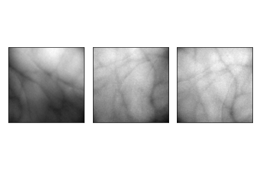
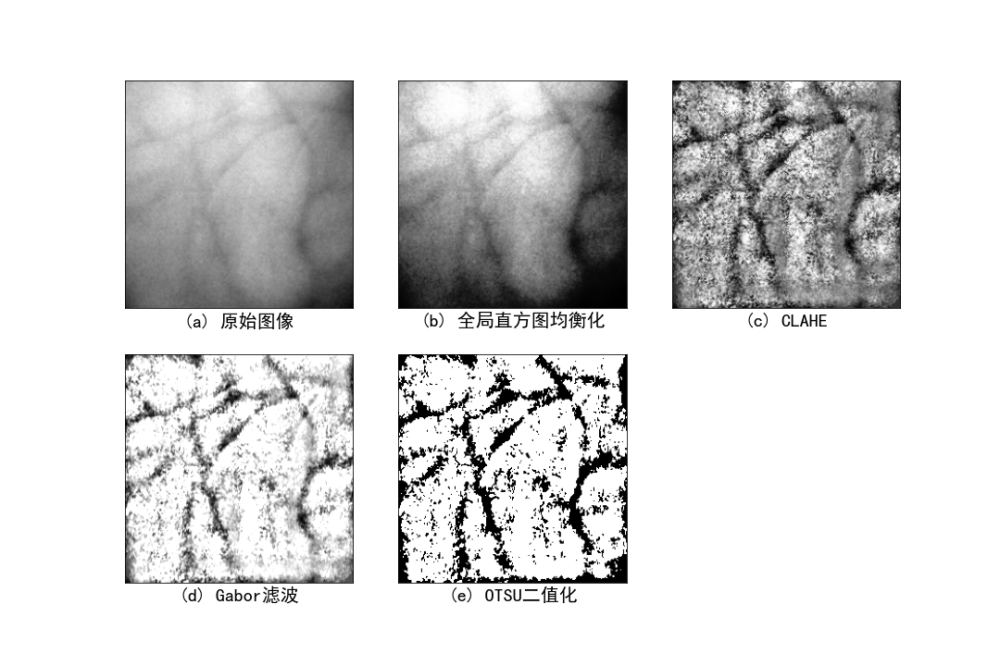
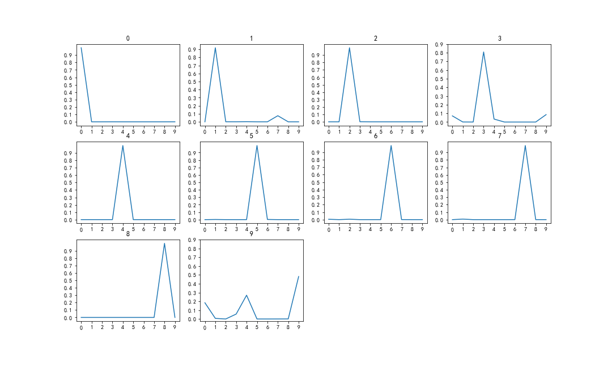
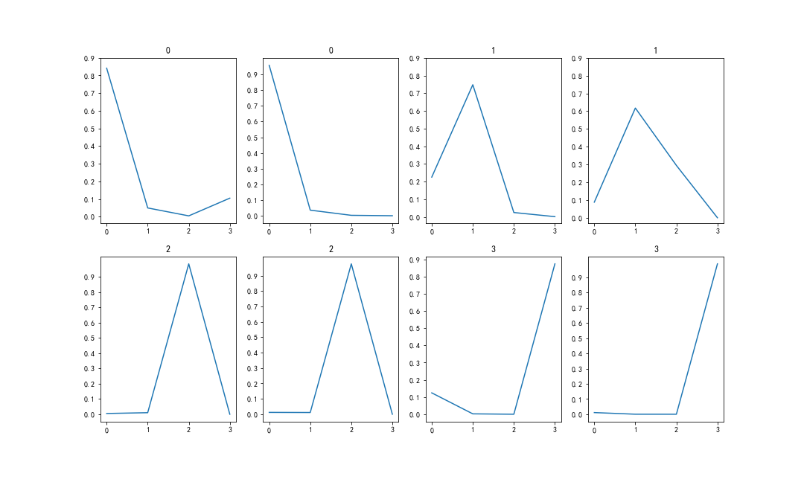

## 项目说明

该仓库为机器视觉创新实践的代码仓库，实现了手指、手掌的静脉图像ROI提取、图像增强，以及使用了VGG-19作为特征提取器和分类器

- 指静脉ROI提取
  
- 掌静脉ROI提取
  
- 指静脉ROI提取示例
  
- 掌静脉ROI提取示例
  
- 指静脉图像增强
  
- 掌静脉图像增强
  
- 指静脉分类结果
  
- 掌静脉分类结果
  

## 文件结构

```
VeinRecognition
│  finger_train.py  --  指静脉训练程序
│  palm_train.py    --  掌静脉训练程序
│  requirements.txt --  库依赖
│  ROI_extract.py   --  ROI提取程序
│  draw.ipynb   --  图片绘制脚本
│  utils.py     --  ROI提取器、图像增强等功能实现
│  .gitignore  
│  README.md
├─documents     --  参考文档
├─finger    --  指静脉原图像
├─palm  --  掌静脉原图像
├─pics  --  绘制好的图片
├─ROI_finger    --  提取出的指静脉ROI
└─ROI_palm  --  提取出的掌静脉ROI
```